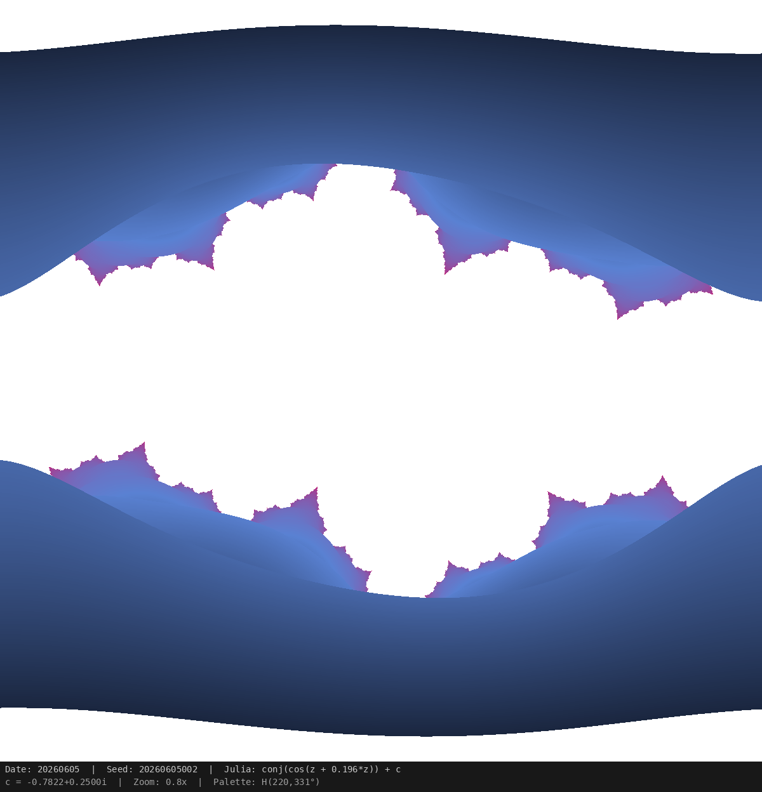

# Daily Fractal

日付をseedとしたフラクタル画像を毎日自動生成するリポジトリ。

## Today's Fractal

<!-- GitHub Pages を有効にしたら、以下のURLを自分のユーザー名/リポジトリ名に書き換えてください -->


> 画像は毎日 UTC 20:00（日本時間 05:00）に自動更新されます。同じ日には同じ画像が生成されます。

## 仕組み

- **GitHub Actions** が毎日 cron で `generate.py` を実行
- 日付（YYYYMMDD）を乱数seedとして、制約付きランダムパラメータでフラクタルを生成
- 生成画像を `docs/daily.png` に保存し、自動コミット
- **GitHub Pages**（`docs/` フォルダ）で静的配信

## ローカル実行

```bash
pip install -r requirements.txt

# 今日のフラクタルを生成
python generate.py

# 特定の日付を指定
python generate.py 20260101

# テスト（複数日分を一括生成）
python test_generate.py
```

## GitHub Pages で公開する

1. リポジトリの Settings → Pages
2. Source: `Deploy from a branch`
3. Branch: `main`, Folder: `/docs`
4. 保存後、以下のURLでアクセス可能:

```
https://<USER>.github.io/daily-fractal/daily.png
```

README内の画像URLも上記に差し替えると、外部からも表示されます:

```markdown

```

## ディレクトリ構成

```
daily-fractal/
├── generate.py              # フラクタル生成スクリプト
├── test_generate.py         # テストスクリプト（複数日分生成・再現性確認）
├── requirements.txt         # Python依存パッケージ
├── docs/
│   ├── index.html           # GitHub Pages トップページ
│   └── daily.png            # 生成画像（自動更新）
└── .github/workflows/
    └── generate.yml         # GitHub Actions ワークフロー
```
